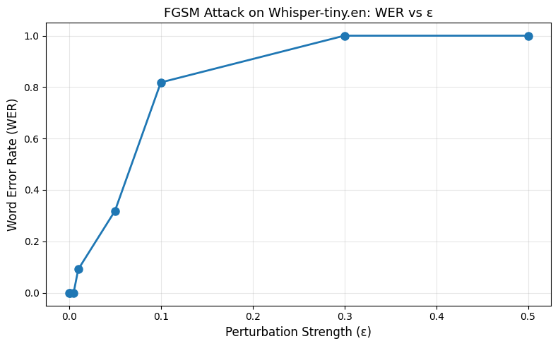
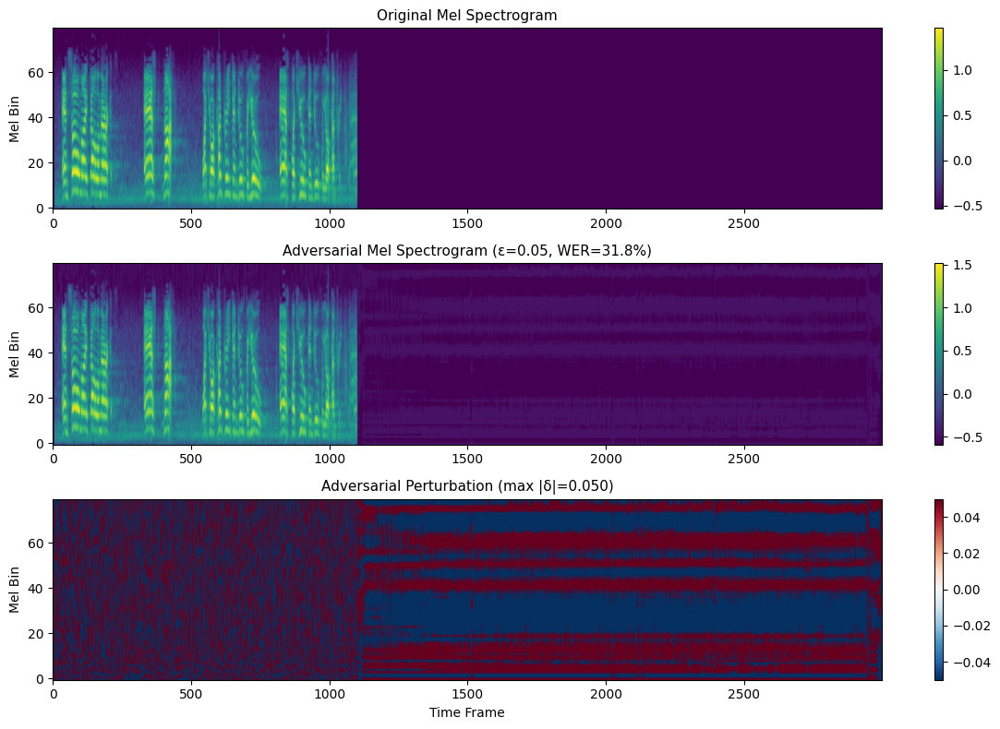

# Whisper ASR Adversarial Attack via FGSM

A minimal implementation of FGSM (Fast Gradient Sign Method) attack on OpenAI Whisper ASR model.

## 项目背景

This project explores the vulnerability of modern ASR models to adversarial perturbations. Built as a starting point for studying AI safety in speech systems.
- Tutorial Reference: [Adversarial Example Generation](https://docs.pytorch.org/tutorials/beginner/fgsm_tutorial.html)

## 实验结果
对whisper模型在JFK音频样本上进行FGSM攻击的系统性扫描，绘图比较各扰动强度ε下模型识别的准确率及固定扰动ε下音频频谱方向的影响
|   ε   |  WER（词错率） |                  Adversarial Transcription（对抗识别样本）               | 
|-------|-------------------|-------------------------------|
| 0.000 |       0.0%         |  And so my fellow Americans ask not what your country can do for you... |
| 0.001 |       0.0%         |  And so my fellow Americans ask not what your country can do for you... |
| 0.005 |       0.0%         |  And so my fellow Americans ask not what your country can do for you... |
| 0.010 |       9.1%         |  And so am I fellow Americans. Ask not what your country can do for ... |
| 0.050 |       31.8%        |  And so am I fellow America's......ass enough! Like your country can... |
| 0.100 |       81.8%        |  And so all night I fell all America. They asked, like you are a pla... |
| 0.300 |       100.0%       |  I'm going to go to the next one.                                       |
| 0.500 |       100.0%       |  Okay, okay, okay, okay, okay, okay, okay, okay, okay, okay, okay, o... |

## 关键点

1. **干扰阈值约在 ε ≈ 0.01-0.05 之间**，低于此阈值模型完全鲁棒
2. **"句法保留但语义错误"的对抗特性**：在 ε=0.05 时，"ask not" 被诱导为 "ass enough"等，表明模型保留句法结构但语义被改变
3. **大扰动触发已知失败模式**：ε ≥ 0.3 时观察到 Whisper 的两种已知缺陷——hallucination（幻觉输出）和 repetition collapse（重复崩溃）

## 方法细节
1. 本项目的攻击作用于 **Whisper 的 log-mel spectrogram 输入空间**,而非原始波形空间。原因是 Whisper 的 mel 特征提取步骤是不可微的,无法直接对 waveform 做梯度计算
2. FGSM公式——对于真实标签 y_true，对抗例子定义为：**x_adv = x + ε·sign(▽_x L(model(x),y_true))**。其中L为模型的损失函数，ε为控制扰动的范数。与模型训练时沿损失下降方向更新参数相反，FGSM沿损失对输入的梯度方向单步施加扰动，从而增大模型损失、诱导识别错误

## 文件结构

- `notebooks/`:
  - `01_whisper_demo.ipynb`: Whisper baseline inference
  - `02_fgsm_attack.ipynb`: FGSM attack implementation
- `results/`: Saved audio samples and plots
- `README.md`
- `requirements.txt`: important modules that needed

## 复现方式

1. Open `02_fgsm_attack.ipynb` in Google Colab
2. Switch runtime to GPU
3. Run all cells

## 相关阅读学习

- Goodfellow et al. "Explaining and Harnessing Adversarial Examples" (2014)
- Carlini & Wagner. "Audio Adversarial Examples" (2018)
- Hao et al. "SafeSpeech" (USENIX Security 2025)

## 后续方向

1. 改用 **PGD (Projected Gradient Descent) 攻击**：目前FSGM是单步攻击，通过PGD扩展验证多步攻击效果
2. **频谱空间 vs 物理空间**:当前攻击发生在 mel spectrogram 空间。未来可结合 vocoder 构建攻击后的音频，实现物理播放攻击，验证人耳听觉层面难以察觉的微小扰动对模型可能造成严重误判
3. **样本规模**:当前仅验证 JFK 单条音频,计划在 test-clean 子集上做统计性评估
